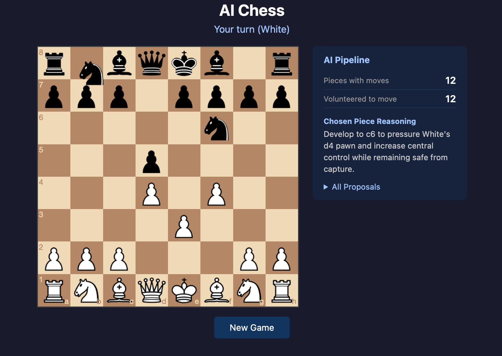

# ♟️ LLM Chess — Every Piece Has a Voice



An interactive chess app where the AI (Black) is chosen by a multi-agent LLM pipeline:

1. Each Black piece with legal moves is polled with **`gpt-5-mini`**.
2. Proposed moves are heuristically scored in Python.
3. An orchestrator model (**`gpt-5.2`**) picks the final move.

Each `gpt-5-mini` piece gets all of its legal moves plus a simple 0 to 1 risk value that estimates how likely that move gets captured next turn.
The `gpt-5.2` orchestrator gets the full proposal list with score weights, but it is free to choose any legal move (not forced to pick the top score).
That score is generated from chess signals like material gain, checks/checkmate, pressure on opponent pieces, center control, and penalties for moving into danger, then normalized.

You play as White in the browser.

## Requirements

Create a `.env` file in the project root:

```bash
OPENAI_API_KEY=your_key_here
```

## Quick Start

```bash
python3 -m venv venv && source venv/bin/activate && pip install -r requirements.txt

python app.py
```

Open: `http://localhost:5000`

## Runtime Behavior Notes

- Backend validates user moves and AI moves against legal chess moves.
- If model output is invalid/unavailable, AI falls back to a legal move.
